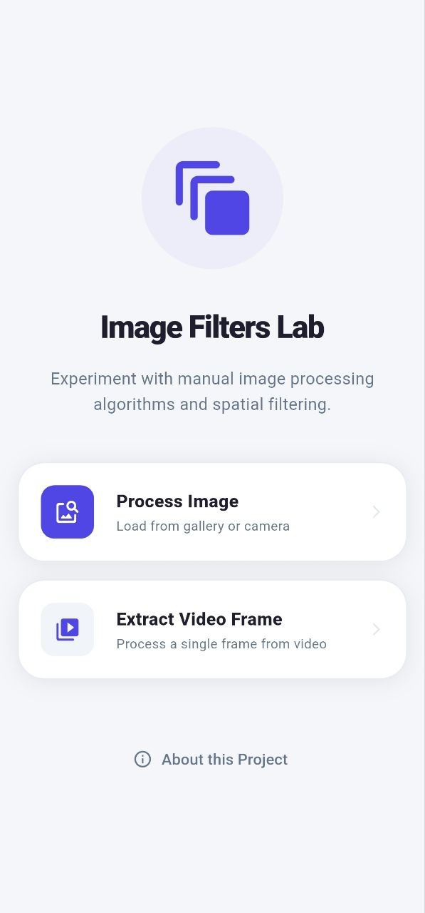
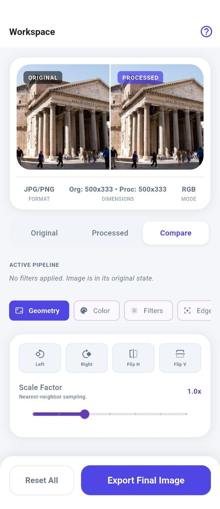
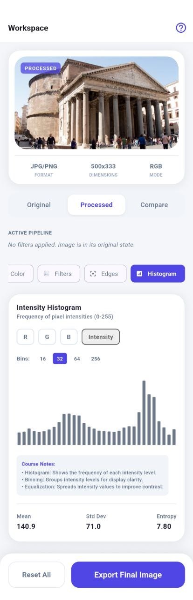
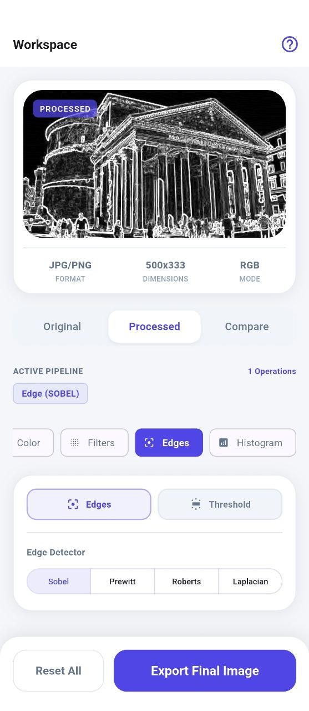
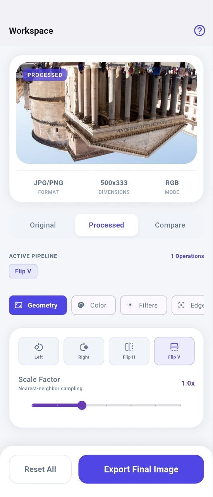

# Image Filters Lab

## Overview
**Image Filters Lab** is a Flutter-based mobile multimedia application built for the **CPIT-380 Multimedia Technologies** course. The app serves as an interactive educational tool where students can experiment with fundamental image processing algorithms. Unlike standard filter apps that use black-box libraries, this lab implements core algorithms (point operations, spatial filtering, geometric transformations) manually at the pixel level to demonstrate the mathematical principles behind digital image manipulation.

## Problem / Objective
Digital image processing concepts—such as convolutions, histograms, and spatial derivatives—can often feel abstract when studied purely through formulas. The objective of this project is to bridge the gap between theory and practice by providing a "live lab" environment. Users can see exactly how changing a kernel weight, a bin count, or a threshold value affects an image in real-time, transforming abstract equations into visual intuition.

## Core Features

### Media Import
- **Image Import**: Load JPG/PNG images from the device gallery.
- **Video Frame Extraction**: Select a video and extract a high-quality still frame for processing.
- **Unified Pipeline**: Process extracted video frames using the same professional image processing suite as static images.

### Geometry Operations
- **Rotation**: Rotate 90° clockwise or counter-clockwise.
- **Reflection (Flip)**: Horizontal and vertical axis flipping.
- **Scaling**: Manual nearest-neighbor interpolation ($0.5x$ to $2.0x$).

### Color & Intensity Operations
- **Grayscale**: Weighted luminance conversion ($0.299R + 0.587G + 0.114B$).
- **Negative**: Full color inversion ($255 - channel$).
- **Sepia**: Warm-tone matrix transformation.
- **Posterization**: Color quantization into discrete levels ($2$ to $16$).
- **RGB Adjustment**: Independent scaling factors for Red, Green, and Blue channels.
- **Brightness & Contrast**: Linear intensity offset and midpoint scaling.

### Histogram Operations
- **Multi-channel Support**: Visualize RGB and Intensity distributions.
- **Dynamic Binning**: Adjust resolution between 16, 32, 64, and 256 bins.
- **Histogram Equalization**: Contrast enhancement using cumulative distribution functions (CDF).

### Spatial Filtering (Smoothing)
- **Mean Filter**: Simple box average smoothing.
*   **Weighted Average**: Center-weighted kernel smoothing (Gaussian-like).
- **Median Filter**: Non-linear noise reduction (Salt-and-Pepper removal).
- **Min Filter**: Erosion-like dark pixel expansion.
- **Max Filter**: Dilation-like bright pixel expansion.

### Edge Detection & Segmentation
- **First-Order Derivatives**: Sobel, Prewitt, and Roberts operators.
- **Second-Order Derivatives**: Laplacian operator.
- **Binary Thresholding**: Intensity-based segmentation ($0–255$).

### Export
- **High-Quality Save**: Export the final processed result back to the device gallery.

## Non-Destructive Processing Pipeline
The app utilizes a deterministic, non-destructive pipeline. The original source bytes (or extracted frame) are preserved, and every adjustment re-builds the result from the source through a verified sequence:

1. **Dynamic Resizing**: Optimizing high-resolution images for mobile performance.
2. **Geometry**: Rotation $\rightarrow$ Flip $\rightarrow$ Scale.
3. **Intensity Normalization**: Grayscale $\rightarrow$ Histogram Equalization.
4. **Color Transforms**: Negative $\rightarrow$ Sepia $\rightarrow$ Posterization.
5. **RGB Balancing**: Manual channel adjustment.
6. **Intensity Scaling**: Brightness and Contrast.
7. **Spatial Smoothing**: Neighborhood convolution and non-linear kernels.
8. **Feature Extraction**: Edge Detection or Binary Thresholding.

## Responsive Workspace UX
The workspace is designed for professional pedagogical use across multiple form factors:
- **Compact Mobile Layout**: Uses category-based control panels (Geometry, Color, Filters, Edges, Histogram) to maximize screen real estate for the image preview.
- **Expanded Tablet/Wide Layout**: Features an optimized two-column design with a persistent preview/pipeline on the left and all experimental controls on the right.
- **Active Pipeline Summary**: A live visual breadcrumb of all operations currently affecting the source image.
- **Progressive Disclosure**: Advanced parameters (like kernel types or RGB factors) only appear when their respective algorithms are enabled.
- **Global Actions**: Fixed "Reset All" and "Export" bar for quick iteration and delivery.

## In-App Learning Support
- **Onboarding**: A 3-step educational introduction explaining media import, processing tools, and the non-destructive pipeline.
- **Concepts Guide**: An integrated pedagogical manual providing academic definitions for Pixels, Histograms, Kernels, and Edge Detectors.
- **Academic Metadata**: Live tracking of image dimensions (width/height) that dynamically updates after geometric operations.

## Technical Architecture
- **Framework**: Flutter (Dart)
- **Processing**: `image` package for pixel-level access and JPG/PNG encoding.
- **Concurrency**: `Isolate.run` used for all heavy processing to keep the UI at 60fps.
- **UI Components**: `fl_chart` for real-time histogram visualization.
- **Media Support**: `image_picker` for gallery access and `video_thumbnail` for frame extraction.
- **Storage/Export**: `gal` for gallery writes and `path_provider` for temporary cache.
- **Logic Isolation**:
  - `ImageAlgorithms`: Pure, standalone mathematical implementations.
  - `ImageProcessor`: Orchestration and pipeline management.
  - `MediaImportService`: Abstracted media acquisition logic.

## Testing
The core algorithms and pipeline are validated by a suite of **44 automated tests**.

**Command:**
```powershell
flutter test test/features/image_lab/
```

**Tested Areas:**
- Color operations (Negative, Sepia, Posterization)
- Convolution filters (Weighted Average impulse response)
- Edge detectors (Sobel/Laplacian gradients)
- Histogram Equalization (CDF accuracy)
- Geometric transformations (Rotation cycles/Reflection identity)
- Pipeline integration (Sequential transform consistency)
- Responsive layout state synchronization

## Screenshots

| Landing Page | Workspace Overview |
|---|---|
|  |  |
| Premium entry screen. | Side-by-side comparison with active pipeline. |

| Histogram Analysis | Edge Detection |
|---|---|
|  |  |
| RGB/Intensity distribution graphs. | Feature extraction using Sobel/Laplacian. |

| Geometry Transforms|
|---|---|
| |
| Multi-step rotation and flipping.|

## Build Release APK
To generate an APK:
```powershell
flutter build apk --release
```
